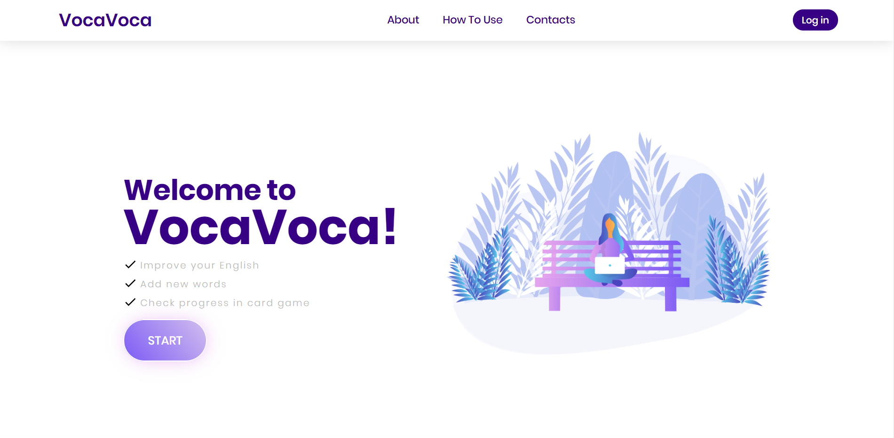

 

   

  <h3 align="center">Flashcards App</h3>

  

    ReactJS app for learning English words
     
     
  

<h1 align="center"> About The Project </h1>

This is a ReactJS project for learning English words. It includes basic authentication (Firebase), API calls to server and Routing.

<h1 align="center"> Built With </h1>

ReactJS, REST API, MobX, Context, Router, Firebase, SASS, Mui (Material-UI)  

